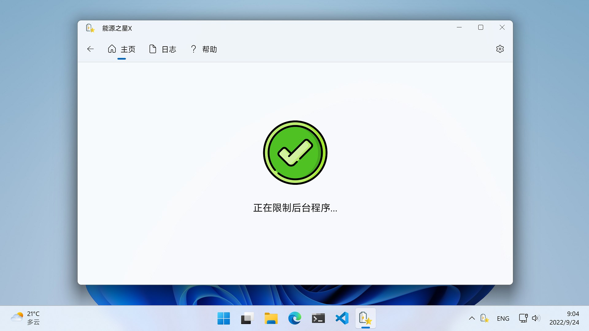

  

<h1 align="center" style="font-weight: bold">
  Energy Star X
</h1>

  🌏
  <a href="README.zh-hans.md">简体中文</a>

  Improve your Windows device's battery life

  
  

# Introduction

Energy Star X leverages Windows 11's [EcoQoS API](https://devblogs.microsoft.com/performance-diagnostics/introducing-ecoqos/) (aka "Efficiency Mode") to throttle background applications to improve battery life and system thermal. It will not throttle foreground application to ensure user experience.

This app is a GUI version of the open source software [EnergyStar](https://github.com/imbushuo/EnergyStar/), developed with Windows App SDK (WinUI 3).

# Requirements

For the best result, you need:

## Software

- Windows 11 22H2 (Build 22621) or above

## Hardware

- Intel 10th gen or newer mobile processors
- AMD Ryzen 5000 or newer mobile processors
- Qualcomm mobile processors

This app can work on Windows 11 21H2 (Build 22000) and older hardware, but may not get the best result.

# Usage

Let it run in background in the system tray. You can choose to run it automatically at startup in settings page.

You can see a green leaf icon next to throttled background process in Task Manager's "Status" column.

# Known Limitations

- If you are using some taskbar enhancement software such as [StartAllBack](https://www.startallback.com/), this app may crash when you hover over system tray icon.
- Child processes do not get boosted when the parent process receives input focus.
- System processes (which is Session 0) do not get throttled. Currently there are some assumption that non-user processes know what they are doing.

# Acknowledgements

- imbushuo: https://github.com/imbushuo/
- App Icon: 
  - https://www.flaticon.com/free-icon/star_3103390/
  - https://www.flaticon.com/free-icon/accept_4303945
  - https://www.flaticon.com/free-icon/pause-button_561920

# How to contribute

See [Contributing.md](./doc/Contributing.md).