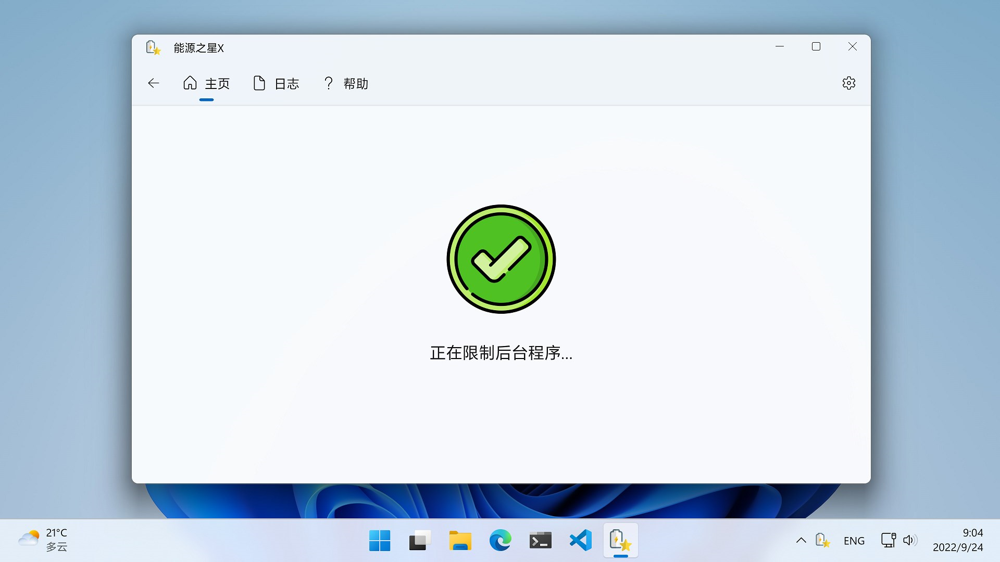
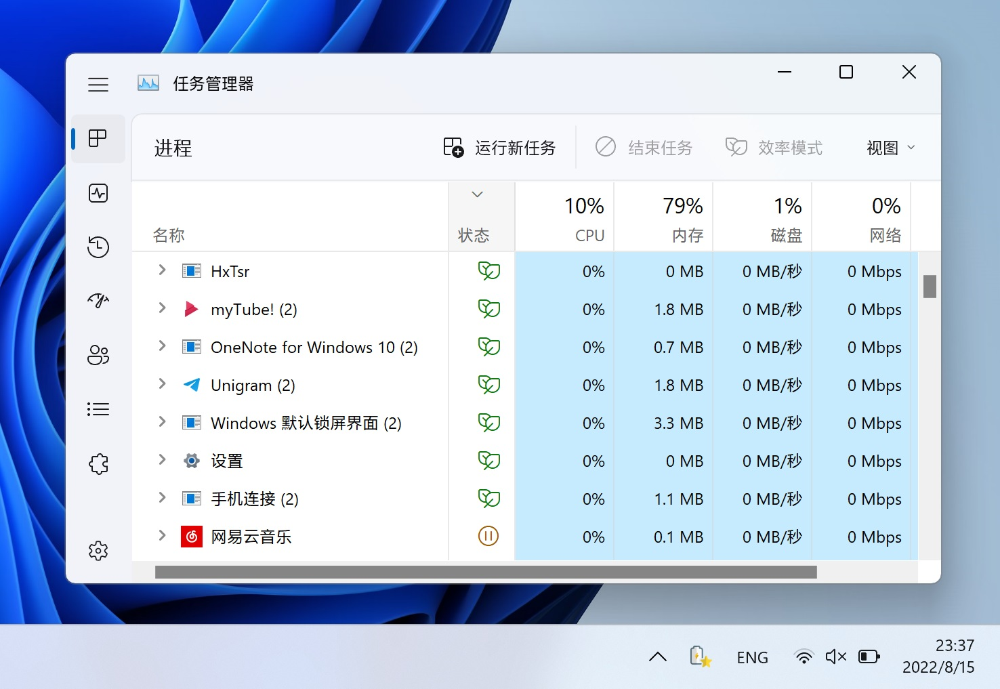

  

<h1 align="center" style="font-weight: bold">
  能源之星X
</h1>

  <a title="从 Microsoft 获取" href="https://apps.microsoft.com/store/detail/9NF7JTB3B17P?launch=true&mode=full" target="_blank">
    <picture>
      <source srcset="https://get.microsoft.com/images/zh-CN%20light.svg" media="(prefers-color-scheme: dark)" />
      <source srcset="https://get.microsoft.com/images/zh-CN%20dark.svg" media="(prefers-color-scheme: light), (prefers-color-scheme: no-preference)" />
      
    </picture>
  </a>

  提升您 Windows 11 设备的电池续航

  
  
  

# 捐赠

## 使用微信扫码：

## 在 [Buy Me a Coffee](https://www.buymeacoffee.com/nickjohn) 上捐赠：

（在手机上打开以使用 Apple Pay 或 Google Pay 支付）

# 简介

能源之星X 利用 Windows 11 的 [EcoQos API](https://devblogs.microsoft.com/performance-diagnostics/introducing-ecoqos/)（即“效率模式”）来限制后台应用的资源占用，从而提高电池续航和散热表现。它不会限制前台应用，以确保用户体验。

此应用是开源程序 [EnergyStar](https://github.com/imbushuo/EnergyStar/) 的图形界面版本，使用 Windows App SDK (WinUI 3) 开发。

# 要求

为了获得最好的效果，你需要：

## 软件

- Windows 11 22H2 (Build 22621) 及以上

## 硬件

- 英特尔 10 代及以上移动处理器
- AMD Ryzen 5000 及以上移动处理器
- 高通移动处理器

此应用可以在 Windows 11 21H2 (Build 22000) 和旧硬件上工作，但是可能不会有最佳效果。

# 使用方法

让它在任务栏右下角后台运行即可。你可以在设置页中选择开机启动。

你可以在任务管理器的“状态”列中看到被限制资源的后台应用旁会显示一个绿叶图标。

# 已知问题

- 如果你使用了 [StartAllBack](https://www.startallback.com/) 等任务栏增强软件，那么当你把鼠标悬停在任务栏右下角图标上时，应用可能会崩溃。
- 当父进程获得输入焦点时，子进程不会被解除资源限制。
- 系统进程（Session 0）将不会被限制资源。目前我们假设非用户进程会自己管理好资源。

# 致谢

- imbushuo：https://github.com/imbushuo/
- 应用图标：
  - https://www.flaticon.com/free-icon/star_3103390/
  - https://www.flaticon.com/free-icon/accept_4303945
  - https://www.flaticon.com/free-icon/pause-button_561920

# 如何贡献

请看 [Contributing.md](./doc/Contributing.zh-hans.md)。